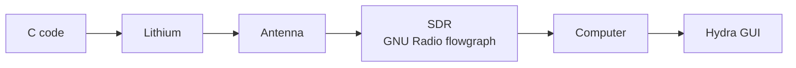

# SWARM-EX Comms: Notes from Meeting with Dhruva

Sep 22, 2026 · @Someone

## Radio hardware (Lithium Li-1 / Li-2)

- Comms reference: section 7.6, Li-2
- Using the Li-1 radio breakout board
- The Lithium radio talks to the ground station, where an SDR does the decoding
- Half-duplex: it can transmit or receive, not both at once
- The Lithium is programmed over UART
- Operating at 9.6 (likely 9600 baud, to confirm)
- Li-2's only change from Li-1 is the modulation

## Power and wiring

Don't cross 7 V on Li-1, always keep an antenna connected, and be careful with power.

- Supply voltage: 7 V for Li-1, 10 V for Li-2 (the Li-1 figure was marked with a "?", so confirm it)
- Check the absolute maximum ratings in Li-1\_User\_Manual-v0.5-2012-04-03.pdf
- Don't worry about 3.3 V
- Connections: Tx, Rx, GND, and power
- Two grounds: one to CDH, one to the power supply

## Packet structure and data flow

Packets follow CCSDS. Hydra sends the whole packet to CDH, and the Lithium adds AX.25 framing around the CDH packet. Reference doc: "packet structure – SWARM\_EX\_Dhruva".

| Field                | Contents                |
| -------------------- | ----------------------- |
| AX.25 header         | Destination, source     |
| CDH packet           | All of the above        |
| AX.25 payload length | Covers the whole packet |
| AX.25 checksum       | 16-bit                  |

- CDH loads the Lithium code
- The CDH packet is wrapped inside the outer packet (notes read "CDI wrapping around CDI packet", probably CDH)
- Tricky part: three sats, so the ground has to handle source and ID for each
- CDMA (code division multiple access) is used across the three sats, and every sat must decode the same way
- Receiving and transmitting: Snap / Crackle / Pop (probably the sat names)

## Ground side: SDR, GNU Radio, Hydra

The goal is to move processing out of GNU Radio and into CDH/Hydra.

The SDR is programmed with a GNU Radio flowgraph, just grabs the signal, and sends it to the computer, where Hydra loads HTML pages.

- Modify blocks in GNU Radio: change the deframer to match the Lithium framing
- Plan for three ground stations to go with the three sats
- One note reads "once you define H2S, Lithium no more" (unclear, check with Dhruva)

## Testing (SCT 1?)

When debugging, look at the GNU Radio output first, then check Hydra's.

- Simulated comms tests covered a single sat, button-based, and cam-based runs
- Only Hydra items were used

## Open questions

- What does CDH want to send?
- What is the current state of CDH?
- Where does the radio connect on CDH?
- What is the button cover currently?
- What package are we getting back in Hydra?
- Where is the SWARM-EX GNU Radio setup?

## Action items

- [ ] Go through the Lithium breakout manual, especially the absolute maximum ratings
- [ ] Play around with the Maxwell GNU Radio setup
- [ ] Find the Maxwell pictures (not in SharePoint)
- [ ] Review the packet structure doc (SWARM\_EX\_Dhruva)
- [ ] Check what package Hydra receives
